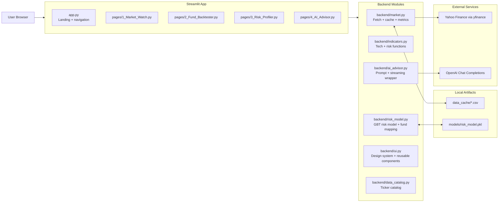
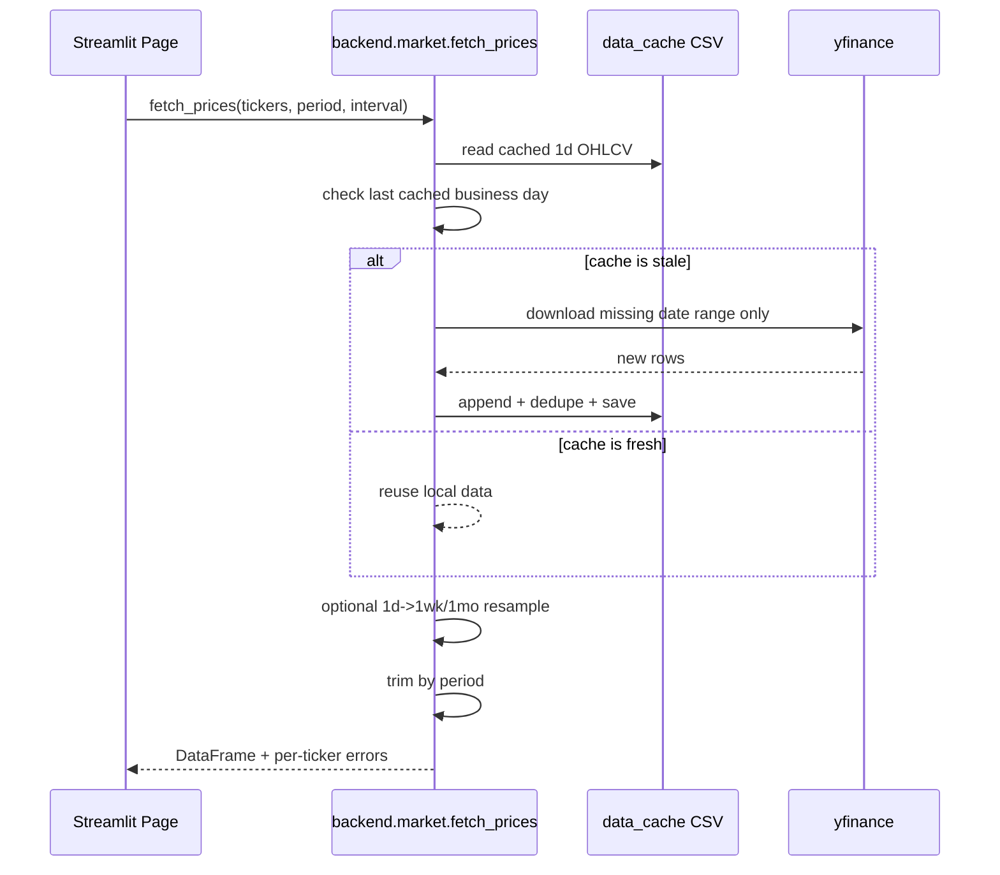

# AssetEra

AssetEra is a multi-page Streamlit portfolio intelligence platform that combines:
- market analytics and technical indicators,
- institutional-style backtesting,
- ML-based investor risk profiling,
- and an OpenAI-powered portfolio Q&A assistant.

The app is designed to run fast with local CSV market cache files, while still auto-refreshing stale data incrementally from Yahoo Finance.

## Table of Contents
- [Architecture](#architecture)
- [Codebase Walkthrough](#codebase-walkthrough)
- [Feature Pages](#feature-pages)
- [Quant and ML Methods](#quant-and-ml-methods)
- [Setup and Run](#setup-and-run)
- [Docker Run](#docker-run)
- [Environment Variables](#environment-variables)
- [Data and Model Artifacts](#data-and-model-artifacts)
- [Troubleshooting](#troubleshooting)
- [Disclaimer](#disclaimer)

## Architecture



### Market data freshness flow



### Risk and advisor context flow

```mermaid
flowchart TD
  IN[User risk questionnaire] --> PR[predict_risk()]
  PR --> RM[GradientBoosting model]
  RM --> RP[Risk score 1-5 + probabilities]
  RP --> RF[recommend_funds()]
  RP --> SS[st.session_state.user_risk_profile]
  SS --> AD[AI Advisor page]
  AD --> SP[get_system_prompt(user_risk)]
  SP --> OA[OpenAI streamed response]
```

## Codebase Walkthrough

### Top-level structure

```text
.
├── app.py
├── backend/
│   ├── ai_advisor.py
│   ├── data_catalog.py
│   ├── indicators.py
│   ├── market.py
│   ├── risk_model.py
│   └── ui.py
├── pages/
│   ├── 1_Market_Watch.py
│   ├── 2_Fund_Backtester.py
│   ├── 3_Risk_Profiler.py
│   └── 4_AI_Advisor.py
├── data_cache/
├── models/
├── requirements.txt
├── Dockerfile
└── docker-compose.yml
```

### Module responsibilities

| Module | Responsibility |
|---|---|
| `app.py` | Landing page, ticker tape, feature cards, navigation to all pages. |
| `backend/market.py` | Allowlisted ticker validation, disk + in-memory cache, incremental yfinance updates, period trimming, metrics/correlation helpers. |
| `backend/indicators.py` | RSI, Bollinger Bands, MACD, ATR, drawdown, beta/alpha, Sortino/Calmar, Monte Carlo GBM utilities. |
| `backend/risk_model.py` | Synthetic training data generation, Gradient Boosting model persistence, risk prediction, fund recommendation mapping. |
| `backend/ai_advisor.py` | Fund-aware system prompt construction and streaming OpenAI chat response wrapper. |
| `backend/ui.py` | Shared CSS theme and reusable UI components (page headers, ticker tape, KPI strips, cards). |
| `backend/data_catalog.py` | Grouped ticker catalog for sidebar selectors. |

## Feature Pages

### 1) Market Watch (`pages/1_Market_Watch.py`)
- Multi-ticker selection from categorized universe.
- Candlestick chart with optional overlays:
  - Bollinger Bands (20,2)
  - RSI (14)
  - MACD (12,26,9)
  - Volume bars
- Normalized performance comparison (index base = 100).
- Correlation heatmap.
- CSV export (summary + timeseries).

### 2) Fund Backtester (`pages/2_Fund_Backtester.py`)
- Simulates predefined funds (F1-F5) using historical returns.
- Optional annual rebalance and fee application.
- Benchmarks: single-ticker and blended (60/40, 80/20, All-Weather).
- Metrics include:
  - Final value, total return, CAGR
  - Sharpe, Sortino, Calmar
  - Max drawdown
  - Beta, annualized alpha
  - VaR/CVaR, upside/downside capture
- Visuals: equity curve, drawdown area, rolling 12M, yearly returns, distribution charts.

### 3) Risk Profiler (`pages/3_Risk_Profiler.py`)
- Collects demographic and behavioral inputs.
- Predicts risk profile (1 to 5) with class probabilities.
- Recommends matching funds from `FUND_PROFILES`.
- Runs Monte Carlo GBM simulation with percentile fan chart.
- Shows model explainability and feature importances.

### 4) AI Advisor (`pages/4_AI_Advisor.py`)
- Chat assistant for fund/risk education and portfolio Q&A.
- Injects fund definitions and optional user risk score into system context.
- Streams responses from OpenAI (`gpt-4o-mini` in current code).
- Maintains conversation history in session state.

## Quant and ML Methods

### Technical analysis
- Relative Strength Index (RSI)
- Bollinger Bands
- MACD
- ATR (utility present in backend)

### Portfolio analytics
- Max drawdown and drawdown series
- Beta and Jensen alpha (annualized)
- Sharpe, Sortino, Calmar
- Rolling/yearly return views
- VaR and CVaR from monthly returns
- Upside/downside capture ratios

### ML risk model
- Algorithm: `GradientBoostingClassifier`
- Training source: synthetic dataset generated from financial planning heuristics
- Training samples: 3,000
- Features: age, income, dependents, marital/employment encoding, horizon, loss tolerance, experience
- Persistence: `models/risk_model.pkl`
- Load behavior: cached resource; retrains only if model file is absent/corrupted

## Setup and Run

### Prerequisites
- Python 3.10+
- `pip`

### Install

```bash
python -m venv .venv
source .venv/bin/activate
pip install -r requirements.txt
```

### Configure environment

```bash
cp .env.example .env
```

Set at least:

```env
OPENAI_API_KEY=sk-proj-...
```

### Start app

```bash
streamlit run app.py
```

Default URL: `http://localhost:8501`

## Docker Run

```bash
docker compose up --build
```

Notes:
- Port mapping: `8501:8501`
- `data_cache` is mounted read-only inside container (`./data_cache:/app/data_cache:ro`)
- Environment variables are loaded from `.env`

## Environment Variables

Current `.env.example` includes:
- `OPENAI_API_KEY` (required for AI Advisor)
- commented Snowflake placeholders (not currently used by the active Streamlit code path)

## Data and Model Artifacts

- `data_cache/*.csv`
  - Per-ticker historical OHLCV files used for fast startup and offline resilience.
  - Incrementally updated when stale.
- `models/risk_model.pkl`
  - Persisted ML model for risk profiling.
  - Rebuilt automatically if missing.

## Troubleshooting

- `OPENAI_API_KEY not configured` on AI page:
  - Add `OPENAI_API_KEY` to `.env` and restart Streamlit.

- Empty charts/backtests:
  - Verify selected tickers are in allowlist and date window has overlap.
  - Check internet connectivity if local cache is missing and refresh is needed.

- First run feels slow:
  - Initial model training and/or first-time yfinance refresh can add startup latency.
  - Subsequent runs are faster due to `st.cache_data`, `st.cache_resource`, and disk cache.

## Disclaimer

AssetEra is an educational analytics project. It does not provide licensed investment advice. Past performance and simulated outcomes do not guarantee future results.
