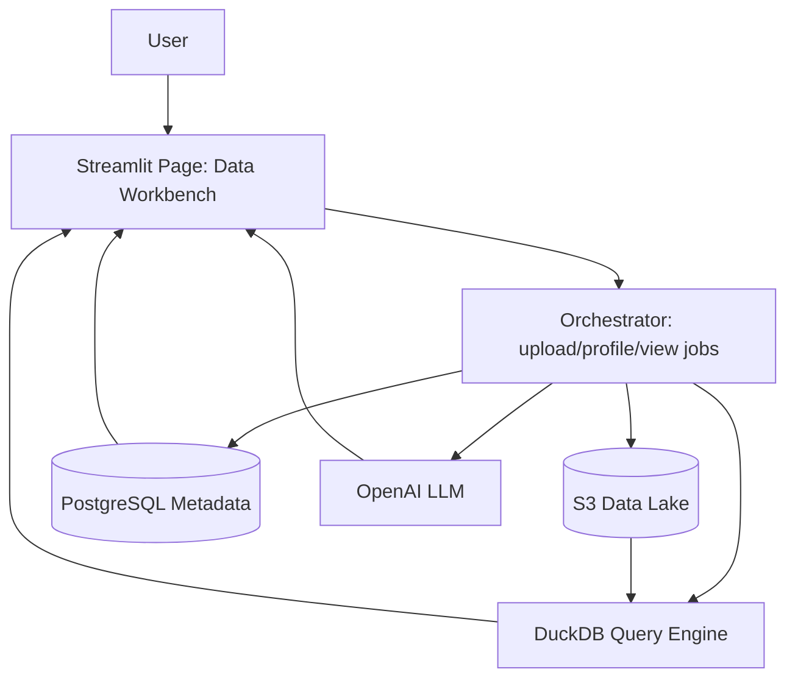
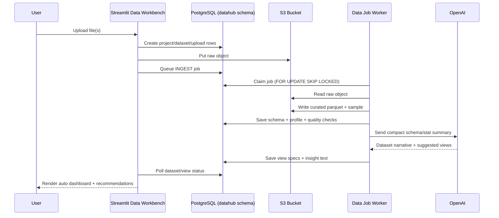

# AssetEra Data Workbench Architecture Blueprint

## 1) Purpose Of This Document

This document describes, in implementation-level detail, how to add a new **Data Workbench** feature to AssetEra for:

- data scientists,
- analysts,
- and beginners who have data but do not know where to start.

The module will let users upload structured or unstructured datasets, store them safely, auto-understand data using deterministic profiling + LLM reasoning, and show direct beginner-to-advanced views without manual setup.

This is designed specifically for the current AssetEra codebase (`Streamlit + Python backend + PostgreSQL`).

## 2) Product Goal

### Problem
Users have data but do not know:

- what is inside,
- what quality issues exist,
- which analysis to run first,
- how to create useful views.

### Goal
Build a guided flow:

1. Upload dataset.
2. Ingest and classify type.
3. Store raw and processed data.
4. Auto-profile and summarize with LLM.
5. Auto-generate useful views.
6. Let users ask follow-up questions in natural language.

### Success Criteria

- User can upload a file and see first useful dashboard in under 60 seconds for small/medium files.
- User receives plain-English summary + quality alerts.
- User gets at least 6 relevant charts generated automatically.
- User can run at least 3 natural-language questions safely on dataset.

## 3) Why S3 Should Be Central But Not The Only Database

S3 is excellent for:

- very large storage,
- any data type,
- cheap long-term retention,
- raw and processed version history.

S3 alone is not enough for:

- app metadata lookups (users, projects, status),
- fast transactional operations,
- queue/job state,
- dashboard configurations and permissions.

Recommended architecture for AssetEra:

- **S3**: raw files + curated parquet + profiling artifacts + generated outputs.
- **PostgreSQL**: metadata, job states, column catalog, view configs, access control.
- **DuckDB query engine (inside app/worker)**: ad hoc analytics directly on parquet in S3.
- **OpenAI LLM**: summaries, recommendations, explanation text, guided next steps.
- **Optional later**: `pgvector` or dedicated vector DB for unstructured retrieval.

## 4) Current Codebase Baseline (What We Already Have)

Current project already includes:

- Streamlit multipage app (`app.py`, `pages/*`).
- Backend module pattern (`backend/*.py`).
- PostgreSQL adapter (`backend/postgres_store.py`).
- Analytics read layer (`backend/analytics_store.py`).
- LLM integration (`backend/ai_advisor.py`).
- Shared styles/components (`backend/ui.py`).

This lets us add Data Workbench without creating a separate web framework.

## 5) High-Level Target Architecture



## 6) Data Flow End-To-End



## 7) Scope By Phase

## Phase 1 (MVP, Recommended)

- Structured file upload: CSV, XLSX, JSON, Parquet.
- S3 raw + curated storage.
- PostgreSQL metadata and job queue.
- Auto profiling and quality checks.
- Auto chart generation (rule-based + LLM-assisted descriptions).
- One new Streamlit page.

## Phase 2

- Unstructured ingestion: PDF, DOCX, TXT.
- Text chunking + embeddings + semantic QA.
- Cross-source insights.

## Phase 3

- Multi-dataset joins and relationship discovery.
- Scheduled refresh jobs.
- Explainable anomaly detection and clustering.

## 8) Repository Integration Plan (Exact Files To Add/Modify)

## New Files

- `backend/datahub_config.py`
- `backend/datahub_store.py`
- `backend/datahub_s3.py`
- `backend/datahub_ingest.py`
- `backend/datahub_profile.py`
- `backend/datahub_quality.py`
- `backend/datahub_llm.py`
- `backend/datahub_views.py`
- `backend/datahub_queries.py`
- `backend/datahub_jobs.py`
- `pages/6_Data_Workbench.py`
- `scripts/run_datahub_worker.py`
- `scripts/init_datahub_schema.sql`
- `docs/DATA_WORKBENCH_ARCHITECTURE.md` (this file)

## Existing Files To Modify

- `app.py`: add new feature card and page navigation.
- `requirements.txt`: add S3/data parsing/query deps.
- `.env.example`: add AWS + Data Workbench variables.
- `docker-compose.yml`: optional worker service.
- `README.md`: architecture and run instructions update.

## 9) Dependencies

Add these packages:

- `boto3` for S3 operations.
- `botocore` (comes with boto3).
- `duckdb` for SQL over parquet.
- `pyarrow` for parquet writing/reading.
- `openpyxl` for xlsx support.
- `python-multipart` optional if later moving to API.
- `pypdf` for phase-2 PDF extraction.
- `tiktoken` optional for token budgeting.

Suggested `requirements.txt` additions:

```txt
boto3>=1.35.0
duckdb>=1.1.0
pyarrow>=18.0.0
openpyxl>=3.1.5
pypdf>=5.1.0
```

## 10) Environment Variables

Add to `.env.example`:

```bash
# Data Workbench
DATA_WORKBENCH_ENABLED=true
DATA_BUCKET=assetera-data-prod
AWS_REGION=ap-south-1
AWS_ACCESS_KEY_ID=
AWS_SECRET_ACCESS_KEY=
AWS_SESSION_TOKEN=
DATA_RAW_PREFIX=raw
DATA_CURATED_PREFIX=curated
DATA_ARTIFACT_PREFIX=artifacts
DATA_MAX_SYNC_MB=200
DATA_PROFILE_SAMPLE_ROWS=50000
DATA_QUERY_ROW_LIMIT=5000
```

Notes:

- On AWS-hosted deployment, prefer IAM role over static keys.
- Keep `POSTGRES_URL` as current metadata DB connection.

## 11) S3 Bucket Layout Standard

Use deterministic pathing for traceability:

```text
s3://{DATA_BUCKET}/
  tenants/{tenant_id}/
    projects/{project_id}/
      datasets/{dataset_id}/
        raw/{upload_id}/{original_filename}
        curated/v1/data.parquet
        curated/v1/sample.parquet
        artifacts/v1/profile.json
        artifacts/v1/quality_report.json
        artifacts/v1/llm_summary.json
        artifacts/v1/view_specs.json
        artifacts/v1/error.log
```

Benefits:

- easy isolation per tenant/project/dataset,
- immutable raw zone,
- versionable curated and artifacts,
- deterministic retrieval.

## 12) PostgreSQL Metadata Schema (datahub)

Create new schema and tables:

```sql
CREATE SCHEMA IF NOT EXISTS datahub;

CREATE TABLE IF NOT EXISTS datahub.projects (
  id UUID PRIMARY KEY,
  user_id TEXT NOT NULL,
  name TEXT NOT NULL,
  description TEXT,
  created_at TIMESTAMP NOT NULL DEFAULT NOW(),
  updated_at TIMESTAMP NOT NULL DEFAULT NOW()
);

CREATE TABLE IF NOT EXISTS datahub.datasets (
  id UUID PRIMARY KEY,
  project_id UUID NOT NULL REFERENCES datahub.projects(id) ON DELETE CASCADE,
  name TEXT NOT NULL,
  source_type TEXT NOT NULL,              -- structured | unstructured | mixed
  status TEXT NOT NULL,                   -- uploaded | ingesting | profiled | failed | ready
  row_count BIGINT,
  column_count INT,
  file_count INT NOT NULL DEFAULT 0,
  schema_version INT NOT NULL DEFAULT 1,
  s3_curated_uri TEXT,
  created_at TIMESTAMP NOT NULL DEFAULT NOW(),
  updated_at TIMESTAMP NOT NULL DEFAULT NOW()
);

CREATE TABLE IF NOT EXISTS datahub.uploads (
  id UUID PRIMARY KEY,
  dataset_id UUID NOT NULL REFERENCES datahub.datasets(id) ON DELETE CASCADE,
  filename TEXT NOT NULL,
  content_type TEXT,
  size_bytes BIGINT NOT NULL,
  sha256 TEXT NOT NULL,
  s3_raw_uri TEXT NOT NULL,
  upload_status TEXT NOT NULL,            -- received | stored | failed
  created_at TIMESTAMP NOT NULL DEFAULT NOW()
);

CREATE TABLE IF NOT EXISTS datahub.columns (
  id BIGSERIAL PRIMARY KEY,
  dataset_id UUID NOT NULL REFERENCES datahub.datasets(id) ON DELETE CASCADE,
  column_name TEXT NOT NULL,
  inferred_type TEXT NOT NULL,            -- numeric | categorical | datetime | text | boolean | mixed
  null_pct DOUBLE PRECISION,
  distinct_count BIGINT,
  min_value TEXT,
  max_value TEXT,
  mean_value DOUBLE PRECISION,
  std_value DOUBLE PRECISION,
  top_values JSONB,
  semantic_label TEXT,                    -- id/email/country/amount/timestamp/... from heuristics+LLM
  created_at TIMESTAMP NOT NULL DEFAULT NOW(),
  UNIQUE(dataset_id, column_name)
);

CREATE TABLE IF NOT EXISTS datahub.profiles (
  id UUID PRIMARY KEY,
  dataset_id UUID NOT NULL REFERENCES datahub.datasets(id) ON DELETE CASCADE,
  profile_version INT NOT NULL DEFAULT 1,
  profile_json JSONB NOT NULL,
  quality_json JSONB NOT NULL,
  narrative_summary TEXT,
  generated_at TIMESTAMP NOT NULL DEFAULT NOW()
);

CREATE TABLE IF NOT EXISTS datahub.views (
  id UUID PRIMARY KEY,
  dataset_id UUID NOT NULL REFERENCES datahub.datasets(id) ON DELETE CASCADE,
  view_name TEXT NOT NULL,
  view_level TEXT NOT NULL,               -- basic | intermediate | advanced
  chart_type TEXT NOT NULL,               -- kpi | line | bar | histogram | scatter | heatmap | table
  priority INT NOT NULL DEFAULT 100,
  spec_json JSONB NOT NULL,
  explanation TEXT,
  created_at TIMESTAMP NOT NULL DEFAULT NOW()
);

CREATE TABLE IF NOT EXISTS datahub.jobs (
  id UUID PRIMARY KEY,
  dataset_id UUID NOT NULL REFERENCES datahub.datasets(id) ON DELETE CASCADE,
  job_type TEXT NOT NULL,                 -- ingest | profile | llm_summary | generate_views | query
  status TEXT NOT NULL,                   -- queued | running | success | failed
  attempts INT NOT NULL DEFAULT 0,
  max_attempts INT NOT NULL DEFAULT 3,
  payload_json JSONB NOT NULL DEFAULT '{}'::jsonb,
  result_json JSONB,
  error_text TEXT,
  created_at TIMESTAMP NOT NULL DEFAULT NOW(),
  started_at TIMESTAMP,
  finished_at TIMESTAMP
);

CREATE INDEX IF NOT EXISTS idx_datahub_datasets_project ON datahub.datasets(project_id);
CREATE INDEX IF NOT EXISTS idx_datahub_uploads_dataset ON datahub.uploads(dataset_id);
CREATE INDEX IF NOT EXISTS idx_datahub_columns_dataset ON datahub.columns(dataset_id);
CREATE INDEX IF NOT EXISTS idx_datahub_views_dataset ON datahub.views(dataset_id);
CREATE INDEX IF NOT EXISTS idx_datahub_jobs_status_created ON datahub.jobs(status, created_at);
```

## 13) Service-Level Module Responsibilities

## `backend/datahub_config.py`

- read env vars,
- default limits,
- feature flags.

Key object:

```python
@dataclass
class DataHubConfig:
    enabled: bool
    bucket: str
    aws_region: str
    raw_prefix: str
    curated_prefix: str
    artifact_prefix: str
    max_sync_mb: int
    profile_sample_rows: int
    query_row_limit: int
```

## `backend/datahub_s3.py`

- create `boto3.client("s3")`,
- upload bytes,
- download objects,
- write/read JSON artifacts,
- generate deterministic S3 URIs.

## `backend/datahub_store.py`

- all PostgreSQL operations for `datahub` schema,
- no business logic in SQL helpers,
- simple CRUD and queue methods.

## `backend/datahub_ingest.py`

- detect file type,
- parse to DataFrame/chunks,
- normalize column names,
- write curated parquet to S3,
- update row/column stats in metadata.

## `backend/datahub_profile.py`

- deterministic dataset profiling:
  - schema,
  - data types,
  - numeric stats,
  - cardinality,
  - missingness,
  - date coverage.

## `backend/datahub_quality.py`

- rule checks:
  - duplicates,
  - null spikes,
  - out-of-range values,
  - mixed-type columns,
  - likely ID leakage.

## `backend/datahub_llm.py`

- produce compact prompt from profile,
- call LLM for:
  - business interpretation,
  - plain-English summary,
  - recommended analysis questions.
- strict token and row limits.

## `backend/datahub_views.py`

- convert profile + LLM hints into chart specs,
- output normalized view specs,
- prioritize beginner-first order.

## `backend/datahub_queries.py`

- safe query execution through DuckDB over S3 parquet,
- read-only SQL guardrails,
- row limit and timeout protection.

## `backend/datahub_jobs.py`

- queue push,
- claim next job with transaction lock,
- run handler pipeline,
- retries and failure capture.

## 14) Ingestion And Classification Details

### Structured Detection

Rules:

- extension in `{csv, xlsx, xls, json, parquet}` -> structured candidate.
- attempt parse; if parse success and tabular shape exists -> structured.
- if parse fails -> fallback to unstructured pipeline (phase 2).

### Unstructured Detection (Phase 2)

Rules:

- extension in `{pdf, docx, txt, md}` -> unstructured.
- extract text blocks and chunk.
- store chunks and optional embeddings.

### Normalization Rules

- standardize column names:
  - trim,
  - lowercase,
  - replace spaces/special chars with `_`,
  - deduplicate (`amount`, `amount_2`).
- infer likely semantic types:
  - numeric,
  - categorical,
  - datetime,
  - text,
  - boolean,
  - mixed.
- keep original names in metadata alias map.

### File Size Modes

- `<= DATA_MAX_SYNC_MB`: process inline request for fast UX.
- `> DATA_MAX_SYNC_MB`: enqueue background job and show progress UI.

## 15) Profiling Logic (Deterministic First)

For each dataset:

- row count, column count, memory estimate.
- per-column:
  - null count / null pct,
  - distinct count / uniqueness pct,
  - min/max for numeric/date,
  - mean/std/percentiles for numeric,
  - top-K categories for categorical.
- cross-column:
  - duplicate row pct,
  - correlations (numeric),
  - strong pairwise associations,
  - date continuity and gaps.

Output artifact:

- `profile_json` (machine-oriented).
- `narrative_summary` (human-readable).

## 16) Data Quality Rules

Minimum rules for MVP:

1. Duplicate rows > 5% -> medium alert.
2. Critical column null pct > 20% -> high alert.
3. Numeric column with > 20% non-numeric parse failures -> high alert.
4. Date column parse success < 80% -> medium alert.
5. Extreme outliers via IQR or z-score -> info/medium alert.
6. ID-like column with near-100% uniqueness -> mark as non-analytic dimension.

Severity model:

- `info`, `warning`, `high`.

Stored in `quality_json`.

## 17) LLM Workflow

LLM should not replace deterministic profiling. It should explain and recommend.

### LLM Inputs (safe and compact)

- dataset name and business context (if user provided),
- sanitized schema,
- aggregate stats only,
- sampled values (limited and masked),
- quality report summary.

### LLM Outputs

- plain-English dataset summary,
- important patterns worth checking,
- suggested KPIs,
- suggested visual views,
- suggested next questions user should ask.

### Prompt Guardrails

- never send full raw dataset.
- mask likely PII columns before sample sharing.
- enforce JSON output schema for downstream parsing.

## 18) Auto View Generation Strategy

Use hybrid approach:

- Rule-based view selector (primary).
- LLM text explanations and optional ranking refinements (secondary).

### Basic Views (always attempt)

- row/column KPI cards,
- missing data heatmap,
- numeric distributions (histograms),
- top categorical values,
- time trend if date + metric exists.

### Intermediate Views

- segment comparison bars,
- correlation heatmap,
- rolling trends,
- contribution decomposition.

### Advanced Views

- anomaly timeline,
- clustering projection (if enough numeric features),
- feature importance style explanation for target-like columns (if user selects target).

### Stored View Spec Example

```json
{
  "view_id": "b1_hist_amount",
  "title": "Distribution Of Transaction Amount",
  "level": "basic",
  "chart_type": "histogram",
  "dataset_ref": "s3://bucket/.../curated/v1/data.parquet",
  "query": "SELECT amount FROM dataset WHERE amount IS NOT NULL LIMIT 5000",
  "encoding": {
    "x": "amount",
    "bins": 40
  },
  "explanation": "Most values are concentrated under 1000 with a long right tail."
}
```

## 19) Query Engine Design (DuckDB Over S3)

### Why DuckDB Here

- lightweight and fast for analytics workloads,
- reads parquet directly,
- simple embedding in Python worker/app,
- no extra managed warehouse needed for MVP.

### Query Safety

- allow only `SELECT` statements.
- reject semicolons and multiple statements.
- enforce `LIMIT <= DATA_QUERY_ROW_LIMIT`.
- execution timeout (for example 20 seconds).
- only query the current dataset URI, no arbitrary S3 path traversal.

## 20) Streamlit UX Design For New Page

Create `pages/6_Data_Workbench.py` with tabs:

1. `Upload`
2. `Overview`
3. `Data Quality`
4. `Auto Views`
5. `Ask Data`

### Upload Tab

- project selector/create,
- file uploader (`accept_multiple_files=True`),
- optional context text ("what does this dataset represent?"),
- upload + process button,
- progress indicators and job status timeline.

### Overview Tab

- dataset summary cards,
- schema table,
- LLM narrative.

### Data Quality Tab

- alerts list by severity,
- missingness chart,
- duplicate summary,
- downloadable quality report JSON.

### Auto Views Tab

- grouped by `basic`, `intermediate`, `advanced`,
- render Plotly charts with existing `CHART_LAYOUT`,
- user can save favorite views.

### Ask Data Tab

- natural-language question box,
- generated SQL preview,
- query result table + chart,
- explanation paragraph + caveats.

## 21) Job Processing Model

Use PostgreSQL as simple queue:

- `status='queued'` inserted by UI.
- worker claims oldest queued job:
  - `FOR UPDATE SKIP LOCKED`,
  - updates to `running`.
- on success:
  - save artifacts,
  - status `success`.
- on failure:
  - increment `attempts`,
  - retry until `max_attempts`,
  - final status `failed` with error text.

Worker entrypoint:

- `scripts/run_datahub_worker.py`

Recommended run modes:

- local dev: run worker manually in second terminal.
- docker deploy: add second service in `docker-compose.yml`.

## 22) Connection And Security Details

### S3 Access

Preferred:

- IAM role attached to runtime.

Fallback:

- `AWS_ACCESS_KEY_ID` + `AWS_SECRET_ACCESS_KEY` in env.

Bucket security:

- block public access,
- enforce TLS (`aws:SecureTransport=true`),
- server-side encryption (SSE-S3 or SSE-KMS),
- bucket policy restricted to required prefixes.

### PostgreSQL Access

- Continue using `POSTGRES_URL`.
- Create separate `datahub` schema, do not mix with existing market tables.
- Principle of least privilege for DB user.

### PII Handling

- detect likely PII columns (email, phone, address, gov id).
- mask before sending samples to LLM.
- maintain `llm_safe_columns` list in profile.

## 23) Suggested IAM Policy (Example)

```json
{
  "Version": "2012-10-17",
  "Statement": [
    {
      "Effect": "Allow",
      "Action": [
        "s3:PutObject",
        "s3:GetObject",
        "s3:DeleteObject",
        "s3:ListBucket"
      ],
      "Resource": [
        "arn:aws:s3:::assetera-data-prod",
        "arn:aws:s3:::assetera-data-prod/*"
      ]
    }
  ]
}
```

## 24) API/Function Contracts (Python-Level)

```python
# backend/datahub_s3.py
def put_bytes(key: str, content: bytes, content_type: str) -> str: ...
def get_bytes(s3_uri: str) -> bytes: ...
def put_json(s3_uri: str, payload: dict) -> None: ...
def read_json(s3_uri: str) -> dict: ...

# backend/datahub_ingest.py
def ingest_upload(upload_id: str) -> dict: ...
def classify_file(filename: str, content_type: str | None) -> str: ...
def normalize_structured(df: pd.DataFrame) -> pd.DataFrame: ...

# backend/datahub_profile.py
def build_profile(df: pd.DataFrame) -> dict: ...

# backend/datahub_views.py
def generate_view_specs(profile: dict, sample_df: pd.DataFrame, llm_hints: dict | None) -> list[dict]: ...

# backend/datahub_queries.py
def ask_dataset(dataset_id: str, question: str) -> dict: ...
```

## 25) App-Level Integration Steps (Order Of Work)

1. Add schema SQL script and run it on current PostgreSQL.
2. Add env vars and S3 bucket.
3. Add backend datahub modules with unit tests.
4. Add worker script and local run command.
5. Add `pages/6_Data_Workbench.py`.
6. Add new feature card in `app.py`.
7. Update `README.md` with setup steps.
8. Add smoke test flow (upload sample CSV -> auto views visible).

## 26) `app.py` UI Integration

Current home page has 5 feature cards. For clean integration:

- move to 2 rows of 3 cards, or
- keep 6 columns if layout permits.

Add a new card:

- Icon: `🧠` or `🗂️`
- Title: `Data Workbench`
- Description: upload data, auto profile, smart views.
- Button: switch to `pages/6_Data_Workbench.py`.

## 27) Docker Compose Integration

Current `docker-compose.yml` has only app service. Add worker service:

```yaml
services:
  app:
    build: .
    ports:
      - "8501:8501"
    env_file:
      - .env
    environment:
      POSTGRES_URL: ${POSTGRES_URL}
    restart: unless-stopped

  datahub_worker:
    build: .
    command: ["python", "scripts/run_datahub_worker.py"]
    env_file:
      - .env
    environment:
      POSTGRES_URL: ${POSTGRES_URL}
    restart: unless-stopped
```

## 28) Failure Handling Strategy

Common failure points:

- upload interrupted,
- parsing failure,
- schema inference mismatch,
- S3 write failure,
- LLM timeout,
- long-running query timeout.

Handling:

- each stage updates job state,
- errors captured in `jobs.error_text`,
- partial artifacts never overwrite previous good version,
- user sees actionable message + retry option.

## 29) Observability

Log events (JSON preferred):

- `upload_received`
- `upload_stored`
- `ingest_started`
- `ingest_completed`
- `profile_completed`
- `llm_summary_completed`
- `views_generated`
- `job_failed`

Metrics to track:

- avg ingestion time,
- avg profile time,
- upload success rate,
- failure rate by stage,
- query latency p50/p95,
- LLM token usage per dataset.

## 30) Testing Strategy

### Unit Tests

- file classification and normalization,
- S3 URI generation,
- profile calculations,
- quality rule evaluation,
- SQL safety parser.

### Integration Tests

- upload CSV -> curated parquet in S3,
- metadata rows inserted correctly,
- worker state transitions.

### UI Smoke Tests

- Data Workbench page loads with feature enabled,
- upload sample file and view summary,
- generated chart renders without exception.

### Security Tests

- ensure non-SELECT query rejection,
- ensure masked fields not sent to LLM,
- ensure unauthorized project/dataset access denied.

## 31) Performance Targets

MVP targets:

- 10 MB CSV: end-to-end under 15 seconds.
- 100 MB CSV: end-to-end under 90 seconds.
- dashboard view render under 2.5 seconds after profile ready.
- Ask Data response under 8 seconds for common queries.

Optimizations:

- write parquet with snappy compression,
- read sampled subset for first render,
- cache profile and view specs in Postgres + Streamlit cache.

## 32) Cost Controls

- sample rows for profiling (no full-table scan for huge files).
- capped LLM context size with token budget.
- avoid repeated LLM runs unless dataset changed.
- lifecycle policy on old temporary artifacts.

S3 lifecycle recommendation:

- raw uploads: keep long-term.
- intermediate temp files: expire in 30 days.
- failed job scratch files: expire in 7 days.

## 33) Rollout Plan

## Sprint 1

- schema + S3 client + structured ingestion.

## Sprint 2

- profiler + quality engine + basic views.

## Sprint 3

- LLM narrative + Ask Data + workerization.

## Sprint 4

- polish UI, tests, docs, and monitoring.

Go-live gates:

- no critical security findings,
- upload success >= 98% in staging,
- end-to-end smoke tests green.

## 34) Detailed MVP Checklist

- [ ] Add dependencies to `requirements.txt`.
- [ ] Add Data Workbench env vars to `.env.example`.
- [ ] Create `scripts/init_datahub_schema.sql`.
- [ ] Add all `backend/datahub_*.py` modules.
- [ ] Add worker script and run command.
- [ ] Create `pages/6_Data_Workbench.py`.
- [ ] Add home card + navigation in `app.py`.
- [ ] Add README setup steps.
- [ ] Add unit tests for profile/quality/query safety.
- [ ] Add one sample dataset for local demo.

## 35) Recommended Defaults For First Release

- Structured files only in initial public release.
- Max upload size 200 MB.
- Sync mode for files <= 50 MB, worker mode above that.
- Minimum generated views: 8 total
  - 4 basic
  - 3 intermediate
  - 1 advanced
- LLM explanation length: short + actionable.

## 36) Risks And Mitigations

Risk: LLM hallucinated claims about data.

Mitigation:

- deterministic profile as source of truth,
- prompt requires uncertainty language,
- show derivation from concrete stats.

Risk: Very large files degrade UX.

Mitigation:

- async jobs,
- sample-first rendering,
- progress status UI.

Risk: Sensitive data exposure.

Mitigation:

- PII masking,
- project-level access checks,
- encryption in transit and at rest,
- redact logs.

Risk: Query abuse in Ask Data.

Mitigation:

- strict SELECT-only parser,
- row limit,
- timeout,
- no arbitrary S3 path access.

## 37) Example User Journey

1. User opens `Data Workbench`.
2. Creates project `Retail Transactions Q1`.
3. Uploads `transactions_q1.csv`.
4. System shows ingest progress.
5. In under a minute, user sees:
   - summary: rows, columns, date range, quality score,
   - warnings: missing values in `customer_region`,
   - views: revenue trend, basket-size distribution, top categories.
6. User asks: "Which segments had the highest month-over-month growth?"
7. System returns:
   - safe generated query,
   - table + chart,
   - short explanation.

## 38) Recommended Next Step For Implementation

Start with the metadata schema + structured ingest pipeline only. Once the structured flow is stable end-to-end in staging, layer in LLM summary and advanced views.

This keeps early delivery fast and reduces risk while still giving immediate value to users.

